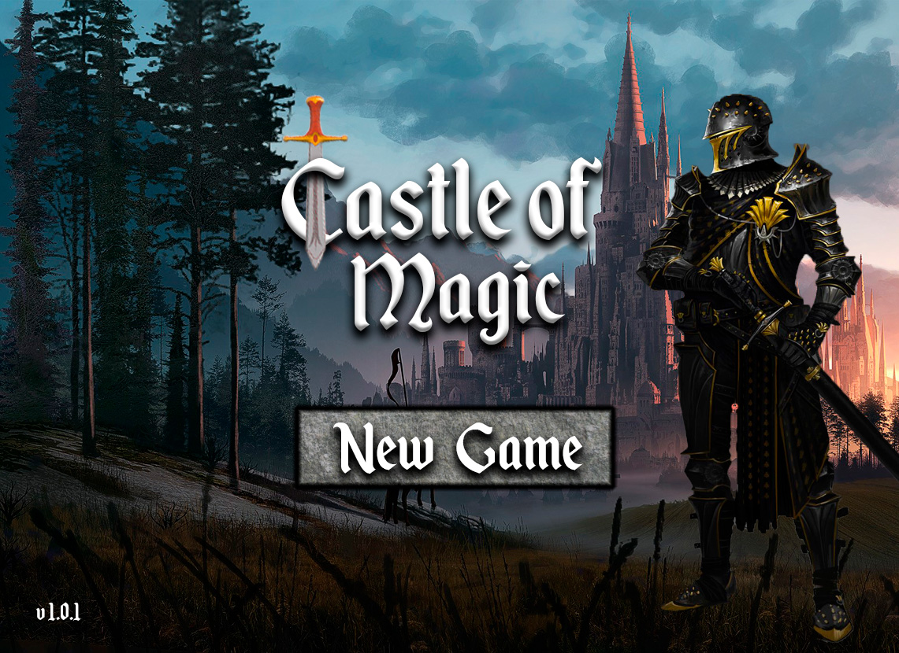

 
***Castle of Magic is a 2D fantasy themed RPG with an exciting story where you will face a series of challenging puzzles and minigames.
Will you succeed? Glory awaits you adventurer!***
 
## Synopsis

You, a young and brave knight, wake up in a meadow and barely remember anything.
All of a sudden, you hear a hopeless man in the forest screaming for help since his daughter has dissapeared.
 
Maybe she's being held hostage in the infamous ***Castle of Magic***...

You decide to help him out and your journey as a hero begins!

Along this journey you will find hints and allies that can help you out so ***pay attention to detail!***

## How to run the game

To start playing the game, you have to :
- Clone this repository to your PC and open it in Eclipse. _(Please, if you do not use Eclipse, set encoding to UTF-8 in your IDE)._
- Run the "ServerLauncher.java" class (found in src/launcher).
- Run the "ClientLauncher.java" class (found in src/launcher).

Then, you will be at the home screen of the game where you will have to :
- Press the "New Game" button in the middle of the screen.
- Type in your character's name.
- Press the "Play" button to the right of the text field.
- Your journey has started, adventurer!

## Commands
- To move around: use the arrows of your keyboard.
- To interact with objects in the world: press 'SHIFT'.

_REMEMBER: If you feel lost or need help you can always type "commands", press enter and a help guide will pop up for you!_ 
